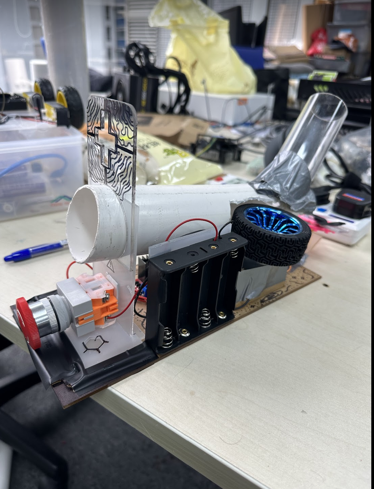
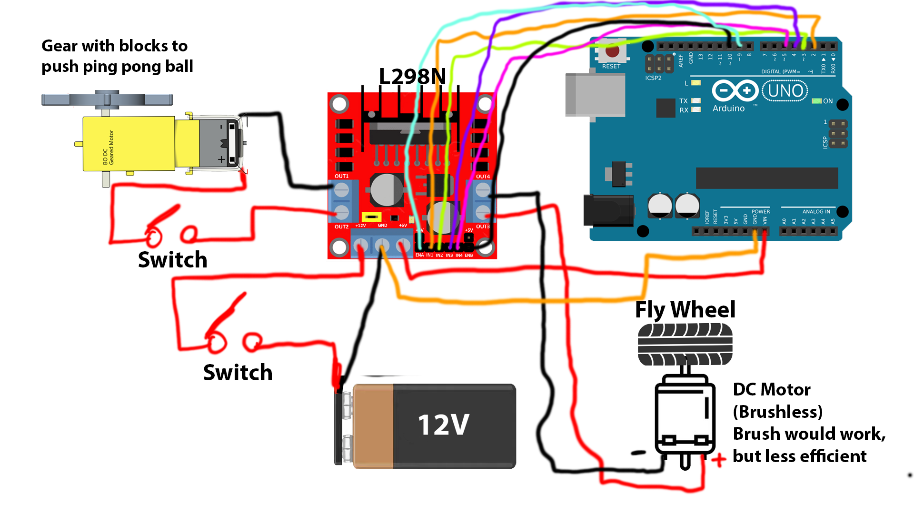

## Cannon

This is a robotics project that uses an Arduino to shoot a ping pong ball.

### Parts

* Arduino Uno
* 1x Brushless DC Motor
* 1x L298N Motor Controller
* 1x 12V Battery
* 1x Regular DC Motor
* 2x Switches 

### How to wire

### How to build?

You can use the CAD Project files in this repo, to build the same one that I built. Or you can build your own, by using the images of my cannon as reference. I have included individual readmes in each folder to explain what the files do and mean.

### How to deploy?
Upload the cannon.ino file to your Arduino. Then connect the Arduino to the circuit as shown in the wiring diagram. Then connect the battery to the circuit. Then press the button to start to start spinning the flywheel, pressing another button will launch the ping pong ball.

### How to open the CAD files?
I used FreeCad which is a free open source cad software. You can download it from [here](https://www.freecad.org/). Then you can open the files.

### Lastly enjoy the building the project, and let me know if there any improvements that I should make. Thanks!